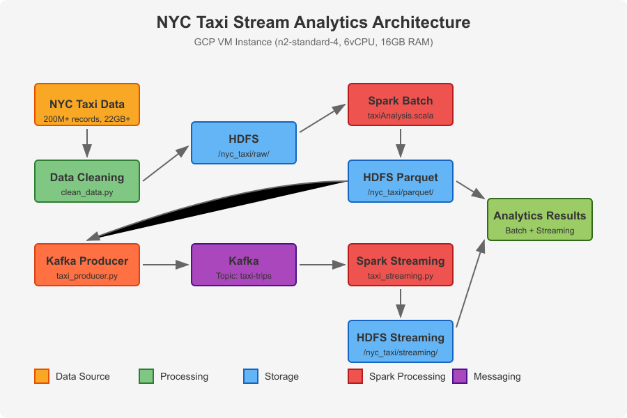

# NYC Taxi Stream Analytics

A comprehensive big data pipeline for processing and analyzing NYC Yellow Taxi trip data using the Hadoop ecosystem deployed on a Google Cloud Platform (GCP) virtual machine.

## Project Overview

This project demonstrates a complete big data analytics solution that processes the NYC Yellow Taxi dataset (200M+ rows, 22+ GB) through both batch and streaming pipelines. The architecture leverages core components of the Hadoop ecosystem to provide distributed storage, efficient processing, and real-time analytics capabilities.

## Infrastructure

### GCP VM Configuration
- **Machine Type**: n2-standard-4 (6 vCPU, 16GB RAM)
- **Operating System**: Debian GNU/Linux 12 (bookworm)
- **Storage**: 100 GB boot disk
- **Network**: Default VPC with firewall rules for service access ports
- **Java Version**: OpenJDK 17/8

### Project Files
- **script.sh**: Main orchestration script to set up the environment and run the pipeline
- **clean_data.py**: Python script for data cleaning and preparation
- **taxi_producer.py**: Kafka producer that simulates real-time taxi data streams
- **taxi_streaming.py**: Spark Streaming consumer that processes real-time data from Kafka
- **taxiAnalysis.scala**: Scala script containing Spark SQL queries for batch analytics

## System Architecture



The pipeline consists of the following components:

### 1. Data Storage Layer (HDFS)
- **Purpose**: Provides reliable, distributed, and fault-tolerant storage for raw and processed taxi data
- **Implementation**: Apache Hadoop HDFS running on the GCP virtual machine
- **Key Features**: Partitioning strategies, redundancy, and scalable storage for large datasets

### 2. Batch Processing Layer (Spark SQL)
- **Purpose**: Performs historical data analysis on the complete dataset
- **Implementation**: Apache Spark's DataFrame API and SQL interface
- **Key Features**: Data exploration, comprehensive analytics, and optimized query performance through format conversion

### 3. Data Format Optimization
- **Purpose**: Enhances query performance and storage efficiency
- **Implementation**: Conversion from CSV to Parquet format with partitioning by VendorID
- **Key Features**: Columnar storage, compression, schema enforcement, and partition pruning

### 4. Streaming Ingestion Layer (Kafka)
- **Purpose**: Enables real-time data ingestion and buffering
- **Implementation**: Apache Kafka with custom producer
- **Key Features**: Topic management, fault tolerance, and message durability

### 5. Stream Processing Layer (Spark Streaming)
- **Purpose**: Processes data in real-time as it arrives
- **Implementation**: Spark Structured Streaming with micro-batch processing
- **Key Features**: Windowed operations, stateful processing, and continuous output

## Data Flow

The data flows through the pipeline in the following sequence:

1. **Data Ingestion**: 
   - NYC Yellow Taxi trip data (12 months of 2015, ~200M records) is cleaned using `clean_data.py`
   - Clean data is stored in HDFS at `/nyc_taxi/raw/cleaned_data.csv`

2. **Batch Processing**:
   - Spark SQL loads data from HDFS for batch analysis using queries in `taxiAnalysis.scala`
   - Complex analytics are performed (trip patterns, fare analysis, etc.)
   - Results are stored back in HDFS in optimized Parquet format at `/nyc_taxi/parquet/`

3. **Streaming Simulation**:
   - The `taxi_producer.py` script reads sample data and continuously sends records to Kafka
   - Data is published to the `taxi-trips` Kafka topic with controlled throughput

4. **Stream Processing**:
   - `taxi_streaming.py` uses Spark Streaming to consume data from Kafka topic in micro-batches
   - Each batch is processed to calculate real-time metrics
   - Results are saved to HDFS at `/nyc_taxi/streaming/`

5. **Analytics Access**:
   - Both batch and streaming results are available in HDFS for further analysis
   - The pipeline supports both historical (batch) and real-time (streaming) analytics

## Implementation Details

### Environment Setup
The entire solution is deployed on a single GCP VM instance, simulating a development environment for a big data pipeline. Key software components:

- **Hadoop 3.3.6**: Used for distributed storage (HDFS)
- **Spark 3.5.5**: For both batch and streaming processing
- **Kafka 2.8.2**: Message broker for streaming data
- **Python 3.x**: For data cleaning and Kafka producer
- **Screen**: Used to manage long-running processes (producer and consumer)

### Big Data Optimizations
- Partitioning data by VendorID for improved query performance
- Using Parquet columnar format for efficient storage and faster queries
- Micro-batch processing for streaming data to balance latency and throughput

## Sample Analytics Insights

### Batch Processing Insights
```
// Total trip count
+------------+
| total_trips|
+------------+
| 146,112,989|
+------------+
// Average metrics by vendor
+--------+----------+------------+--------+-------+
|VendorID|trip_count|avg_distance|avg_fare|avg_tip|
+--------+----------+------------+--------+-------+
|       1| 76,826,901|        2.91|   13.52|   1.83|
|       2| 69,286,088|        3.08|   13.67|   1.95|
+--------+----------+------------+--------+-------+
// Trip distribution by passenger count
+---------------+----------+------------+
|passenger_count|trip_count|avg_distance|
+---------------+----------+------------+
|              1| 95,036,454|        2.89|
|              2| 22,369,817|        3.15|
|              3|  7,363,198|        3.24|
|              4|  4,989,794|        3.38|
|              5|  3,098,939|        3.41|
|              6| 13,254,787|        3.09|
+---------------+----------+------------+
// Payment type distribution
+-------------+--------------------+----------+-------+
|payment_type |payment_description |trip_count|avg_tip|
+-------------+--------------------+----------+-------+
|            1|Credit card         |104,304,912|  2.17|
|            2|Cash                | 41,118,234|  0.00|
|            3|No charge           |    363,182|  0.11|
|            4|Dispute             |    282,982|  0.00|
|            5|Unknown             |     39,401|  0.07|
|            6|Voided trip         |      4,278|  0.02|
+-------------+--------------------+----------+-------+
```
### Streaming Processing Insights
```
// Real-time batch metrics (10-second window)
+------------+------------+--------+--------+
|avg_distance|avg_fare    |avg_tip |trip_count|
+------------+------------+--------+--------+
|       2.94 |      13.58 |   1.87 |      37 |
+------------+------------+--------+--------+
// Sample streaming batch saved to HDFS
Batch 42 received 53 records
Saved batch to /nyc_taxi/streaming/batch_42
```
## Technologies Used

- **Google Cloud Platform**: Infrastructure for running the VM instance
- **Apache Hadoop (HDFS)**: Distributed storage
- **Apache Spark**: Batch processing and analytics
- **Spark SQL**: SQL interface for data analysis
- **Apache Kafka**: Message broker for streaming data
- **Spark Structured Streaming**: Real-time data processing
- **Parquet**: Columnar storage format
- **Python**: For data processing and Kafka producer
- **Scala**: For Spark SQL queries and analytics

## Implementation Challenges and Solutions

1. **Challenge**: Processing the large 12GB+ dataset efficiently on a single VM
   **Solution**: Used Spark's distributed processing capabilities and converted data to Parquet format for faster analytics

2. **Challenge**: Simulating real-time data streams
   **Solution**: Implemented a multi-threaded Kafka producer that samples from the historical dataset

3. **Challenge**: Managing long-running processes
   **Solution**: Used Screen sessions to manage and monitor producer and consumer processes

4. **Challenge**: Setting up and integrating multiple big data technologies
   **Solution**: Created a unified architecture with clear data flow between components

## Conclusion

This project demonstrates a complete big data pipeline that handles both batch and streaming workloads. It showcases the integration of multiple technologies in the Hadoop ecosystem to provide comprehensive analytics capabilities on a large dataset. The architecture is designed to be scalable, with clear separation of storage (HDFS), processing (Spark), and streaming (Kafka) components.

The implementation on a GCP VM instance demonstrates how big data technologies can be deployed in cloud environments, providing a foundation for more extensive, cluster-based deployments in production settings.